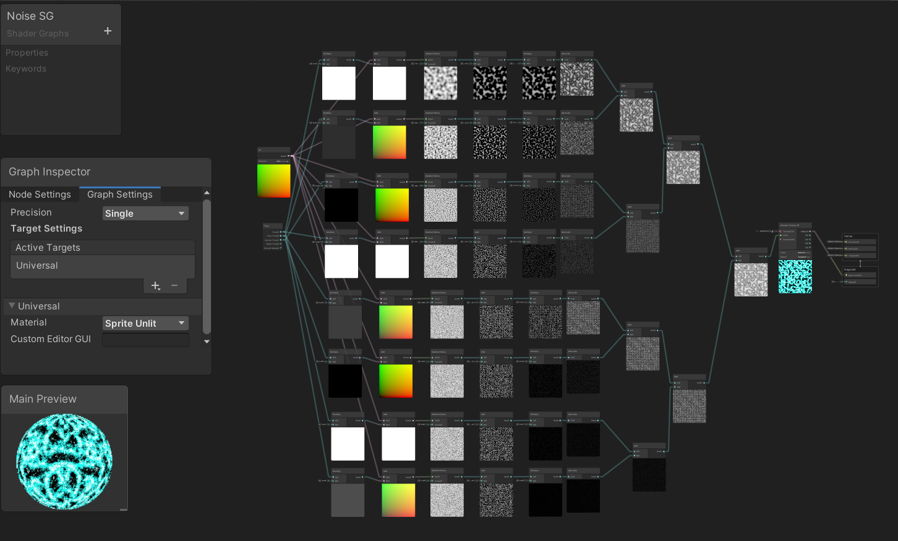

# ノイズ

シェーダを使ってノイズやノイジーに消える表現を実装します。

src フォルダをUnityで開きます。

## 自分なりに変更した点
-
-
-

## 進め方

- Unityのプロジェクトを更新して実装してください。
  - 結果画像1（一番上の画像）と同じシーンを「1 Simple Scene」に実現してください
  - 結果画像2（二番目の画像）と同じシーンを「2 Scaling Scene」に実現してください
  - 結果画像3（三番目の画像）と同じシーンを「3 FBM Scene」に実現してください
  - 結果画像4（四番目の画像）と同じシーンを「4 Anim Scene」に実現してください
  - 結果画像5（五番目の画像）と同じシーンを「5 Alpha Clip Scene」に実現してください
  - 結果画像6（六番目の画像）と同じシーンを「6 Clip Noise Scene」に実現してください
  - 結果画像7（六番目の画像）と同じシーンを「7 Desolve Scene」に実現してください
  - 自分なりにかっこいいシーンを「8 My Best Scene」に作成してください
- 「8 My Best Scene」の結果をUnity RecorderでMovieとして保存し、result1.gifと差し替えてください（サイズが大きくて上げられない場合は、解像度を小さくするなどして下さい）
- node_graph.pngを自分のシェーダグラフの一番頑張ったノードと差し替えてください
- このテキストファイルに変更点を記載してください
- プルリクエストを出して提出してください
